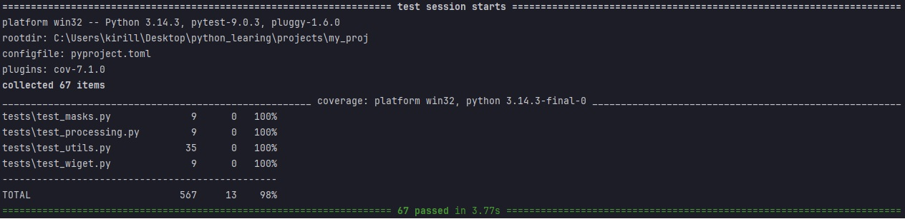

# **Виджет банковских операций**

## *Цель проекта*
Обеспечить бэкенд-часть нового виджета для IT-отдела крупного банка. 
Виджет отображает клиенту 3–5 последних успешных операций по его счетам. 
Для повышения безопасности и соответствия стандартам PCI DSS,
перед передачей данных на фронтенд выполняется маскирование конфиденциальной информации:

* Номеров банковских карт (показываются только тип, первые шесть и последние 4 цифры).
* Номеров банковских счетов (показываются только последние 4 цифры).
* Преобразуется дата выполнения операции(из 2024-03-11T02:26:18.671407 в 11.03.2024)

## *Установка*
Для использования модуля в вашем бэкенд-сервисе (например, FastAPI, Django, Flask) выполните следующие шаги:

1.Клонируйте репозиторий:

git clone [git@github.com:molochkoannav/my_project.git]
cd my_project
(Опционально) Создайте и активируйте виртуальное окружение:

python -m venv venv

source venv/bin/activate  # Для Linux/Mac

venv\Scripts\activate     # Для Windows

Установите зависимости (если есть requirements.txt):

pip install -r requirements.txt
В текущей версии проекта внешние библиотеки не требуются.

## *Использование функций*
Импортируйте функции в ваш код для маскировки данных 

1.get_mask_card_number(card_number: str) -> str
Маскирует номер банковской карты в формате:
1234 12** **** 1234 

2.get_mask_account(account_number: str) -> str
Маскирует номер банковского счета в формате:
**1234 (показываются только последние 4 цифры).

3.get_date(data: str) -> str:
Конвертирует правильное обозначение даты:
ДД.ММ.ГГГГ

4.filter_by_state(api_list: list, state: str = "EXECUTED") -> list
Функция фильтрует списки словарей, по ключу 'state'

5.sort_by_date(api_list: list, sort_by: str = "date", reverse: bool = True) -> list
Функция сортирует список словарей по дате

6.filter_by_currency(transactions: list, cur: str = "USD") -> Generator
Функция фильтрует id по типу валюты (по умолчанию - USD)

7.transaction_descriptions(transactions: list)-> Generator
Функция возвращает описание каждой транзакции

8.card_number_generator(start_num: int, stop_num: int)-> Generator
Функция генерирует номера банковских карт в формате ХХХХ ХХХХ ХХХХ ХХХХ

9.Декоратор log для логирования результатов выполнения функций, 
при передаче файла в параметре декоратора, логи будут записываться в файл, при отсутствии файла - в консоль.

10.Модуль data_loger.py создан для чтения CSV и EXCEL файлов, 
функции принимают путь к файлу и возвращает список словарей.

## *Тестирование*

Для обеспечения надежности и корректной работы всех функций виджета был проведен комплексный процесс тестирования.

### Реализованные тесты
Разработаны следующие модули покрывающих весь функционал проекта:
- test_masks.py (Модуль тестирования маскировки номеров карт и счетов отдельно)
- test_wiget.py (Модуль тестирования маскировки карт и счетов, а так же преобразования дат)
- test_processing.py (Модуль тестирования фильтрации и сортировки данных)
- test_generators.py( Модуль тестирования генераторых функций)
- test_decorator.py (Модуль тестирования декоратора для логирования)
- test_data_loader.py (Модуль тестирования модуля data_loader.py)

### Результаты тестирования
- ✅ **Протестированы все функции** 
- 📊 **Покрытие кода тестами: 93%**
- 🔍 Все краевые случаи и возможные ошибки обработаны

### Скриншот отчета о покрытии

Отчет о покрытии тестами 98%

*На скриншоте представлен отчет инструмента pytest --cov, демонстрирующий 98% покрытие кода.*

### Запуск тестов (для разработчиков)

# Установка зависимостей для тестирования
pip install pytest pytest-cov

# Запуск всех тестов с отчетом о покрытии
pytest --cov
pytest --cov=. --cov-report=term-missing

# Генерация HTML-отчета (откроется в браузере)
pytest --cov=. --cov-report=html
# Затем откройте файл htmlcov/index.html

Данный виджет разработан в рамках учебного проекта.
По всем вопросам обращайтесь по адресу [molochkoannav@gmail.com].